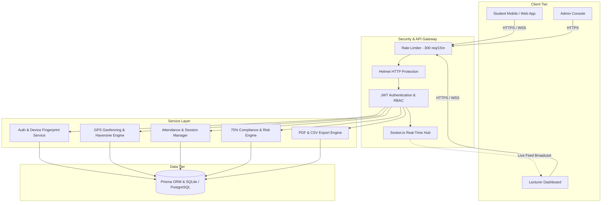
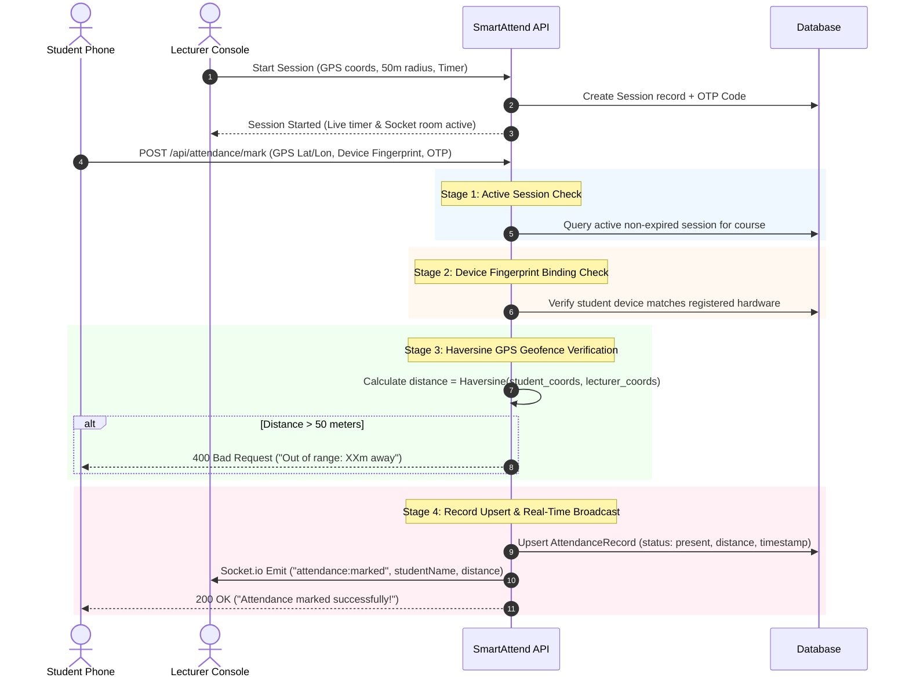
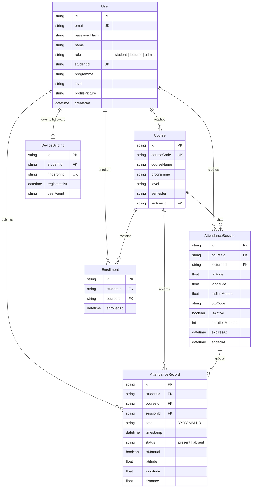

# SmartAttend — System Architecture & Technical Specifications

SmartAttend is an enterprise-grade university attendance management system engineered for **Takoradi Technical University (TTU)**. It features a multi-tiered security pipeline designed to eliminate proxy attendance in large lecture halls.

---

## 1. System Architecture

---

## 2. Multi-Layer Anti-Proxy Verification Pipeline

Every attendance submission undergoes a **4-stage cryptographic and geospatial verification process** before a record is created:

---

## 3. Database Entity-Relationship Diagram

---

## 4. Geospatial Verification Engine (Haversine Formula)

The server calculates the precise geodesic distance between student coordinates $(\phi_1, \lambda_1)$ and lecturer session coordinates $(\phi_2, \lambda_2)$ using the Earth radius $R = 6,371,000\text{ m}$:

$$\Delta\phi = \phi_2 - \phi_1, \quad \Delta\lambda = \lambda_2 - \lambda_1$$

$$a = \sin^2\left(\frac{\Delta\phi}{2}\right) + \cos(\phi_1)\cos(\phi_2)\sin^2\left(\frac{\Delta\lambda}{2}\right)$$

$$c = 2 \cdot \text{atan2}\left(\sqrt{a}, \sqrt{1 - a}\right)$$

$$d = R \cdot c$$

If $d \le 50\text{ meters}$, attendance is accepted; otherwise, it is strictly rejected.
